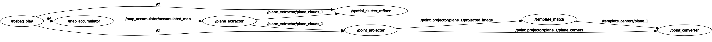

# 编译环境

sudo apt install ros-noetic-vision-msgs
sudo apt install ros-noetic-jsk-recognition-msgs

# 节点&话题依赖



# all_launch 说明

| 包名                | launch 文件名                    | 节点名                    | 功能                       |
| ------------------- | -------------------------------- | ------------------------- | -------------------------- |
| `ring_detector`     | `roi_mapping.launch`             | `map_accumulator_node`    | 积累点云                   |
| `cloud_recognition` | `plane_extractor.launch`         | `plane_extractor`         | 提取平面                   |
| `fast_detector`     | `spatial_cluster_refiner.launch` | `spatial_cluster_refiner` | 固定平面                   |
| `cloud_recognition` | `point_projector.launch`         | `point_projector`         | 点云投影到平面             |
| `cloud_recognition` | `template_match.launch`          | `template_match`          | 模板匹配                   |
| `cloud_recognition` | `point_converter.launch`         | `point_converter`         | 计算匹配框的中心的三维坐标 |

# 输入说明

订阅话题为`cloud_registered`单帧点云

# 输出说明

话题为`all_plane_3d_detections`
自定义消息包`Detection3DWithIDArray.msg`
包含障碍物的中心的三维坐标、障碍物的类型（0、1、2……）

```
#include "cloud_recognition/Detection3DWithID.h"
#include "cloud_recognition/Detection3DWithIDArray.h"
```

```
void detectionCallback(const cloud_recognition::Detection3DWithIDArray::ConstPtr& msg)
```

```
msg->detections[i].point.x
msg->detections[i].point.y
msg->detections[i].point.z
msg->detections[i].id
```

# 自定义消息包

```
# Detection3DWithID.msg
std_msgs/Header header
geometry_msgs/Point point
int32 id
geometry_msgs/PoseStamped plane_pose
```

```
# Detection3DWithIDArray.msg
std_msgs/Header header
Detection3DWithID[] detections
```

# `generatePointsFromDetection`函数接口

## INPUT

类型：`cloud_recognition::Detection3DWithID`
含义：障碍物的中心的三维坐标

## OUTPUT

类型：`std::vector<cloud_recognition::Detection3DWithID>`
含义：穿越障碍物的有序点

## NOTICE

- 需要飞机位姿`nav_msgs::Odometry local_pos`
- 参数在`detection_processor.h`里面

# 参数修改说明

| 节点              | 参数位置                                       | 主要参数                     |
| ----------------- | ---------------------------------------------- | ---------------------------- |
| `plane_extractor` | `plane_config.yaml`                            | roi、平面数、输入输出话题    |
| `point_projector` | ` point_projector.launch`、`projector_config ` | 分辨率、输入话题             |
| `template_match`  | `template_match.launch`                        | 平面数、模板参数、匹配参数   |
| `point_converter` | `point_converter.launch`                       | 平面数、更新半径、预筛选阈值 |

## roi 参数

| 包名                | 文件                   |
| ------------------- | ---------------------- |
| `ring_detector`     | `map_accumulator.yaml` |
| `cloud_recognition` | `plane_config.yaml`    |

## 平面数量（与话题数量）参数

| 包名                | 文件                                  |
| ------------------- | ------------------------------------- |
| `cloud_recognition` | `plane_topic_num.launch`|
